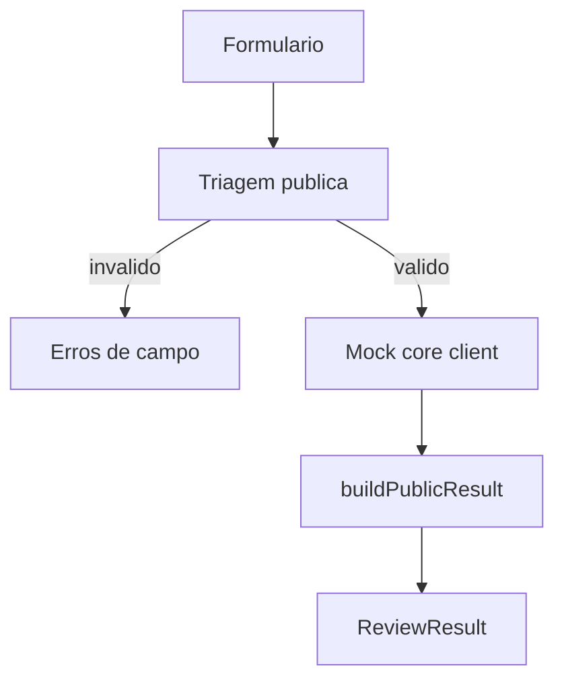

# Agente Carreira IA

Camada publica do `agente-carreira-ia` para **revisao de curriculo**.

Hoje o repositorio esta em **v1 mock-first local**:
- coleta a entrada minima;
- faz triagem publica;
- chama um mock estatico do core;
- apresenta o resultado no formato publico da v1.

## Status Atual

| Item | Estado |
| --- | --- |
| escopo | revisao de curriculo |
| interface | local, tela unica |
| stack | Vite + React + TypeScript |
| integracao com core real | ainda nao |
| fonte de resposta | fixtures JSON canonicos |

## O Que Ja Existe

- formulario simples para coleta inicial;
- triagem dos campos obrigatorios;
- cliente mock trocavel pelo core real depois;
- apresentacao do resultado estruturado da v1;
- contrato publico documentado.

## O Que Ainda Nao Existe

- integracao HTTP com `agente-carreira-ia-core`;
- autenticacao;
- upload de arquivo;
- historico;
- LinkedIn;
- entrevista.

## Rodar Localmente

```bash
npm install
npm run dev
```

Depois, abra o endereco mostrado pelo Vite.

## Fluxo Atual



## Documentos Principais

| Documento | Papel |
| --- | --- |
| `docs/contrato-com-o-core.md` | contrato publico de entrada e saida |
| `docs/exemplo-de-troca-com-o-core.md` | fixture canonico da v1 |
| `docs/arquitetura-v1.md` | visao leve da arquitetura local |
| `docs/fluxo-mock-first.md` | fluxo operacional do prototipo |

## Estrutura Minima

```text
src/
├── App.tsx
├── components/
├── core-client/
├── fixtures/
├── presentation/
├── review-triage/
└── types/
```

## Limites Do Repositorio Publico

- nao expor prompt privado;
- nao expor rubrica interna;
- nao reproduzir logica sensivel do core;
- nao inferir saida a partir de texto livre quando houver contrato estruturado.
