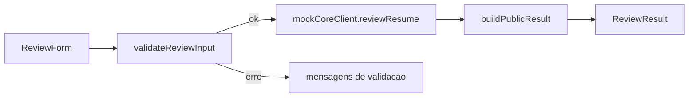

# Arquitetura V1

## Objetivo

Descrever a arquitetura minima da v1 local, sem backend real.

## Blocos

| Bloco | Papel | Arquivos |
| --- | --- | --- |
| entrada | coleta os dados minimos | `src/components/ReviewForm.tsx` |
| triagem | valida se a entrada pode seguir | `src/review-triage/validate-review-input.ts` |
| cliente do core | abstrai a chamada ao core | `src/core-client/mock-core-client.ts` |
| apresentacao | adapta a saida para a UI | `src/presentation/build-public-result.ts` |
| tela final | exibe o resultado publico | `src/components/ReviewResult.tsx` |
| orquestracao | conecta tudo em uma tela | `src/App.tsx` |

## Fluxo De Arquitetura

## Fronteira Publica

| A camada publica faz | A camada publica nao faz |
| --- | --- |
| coleta dados do usuario | avaliar curriculo com logica propria |
| valida campos obrigatorios | reproduzir rubrica do core |
| consome fixture/contrato | expor prompt interno |
| apresenta o resultado | inventar campos fora do contrato |

## Troca Futura

- manter `mockCoreClient` como ponto de troca;
- preservar `ReviewInput` e `ReviewOutput` como contrato;
- evitar acoplamento da UI ao formato bruto do fixture.
